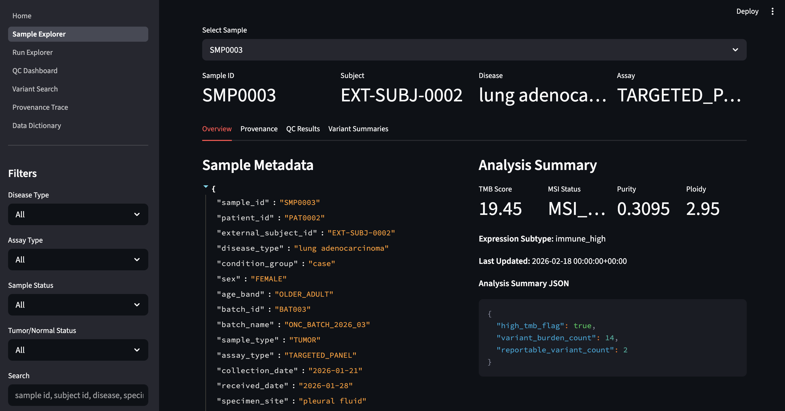
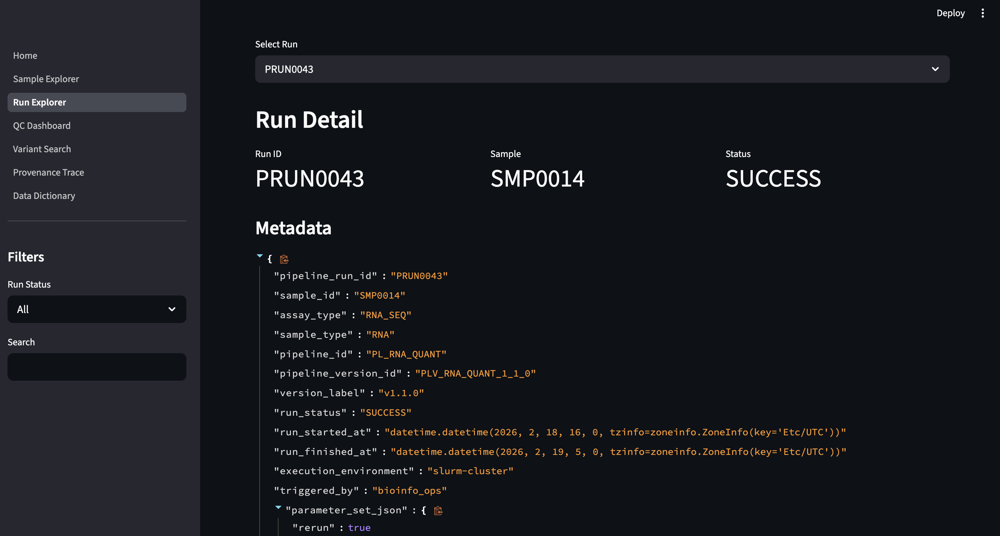
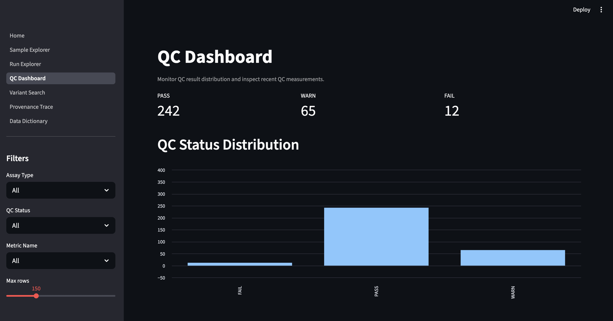
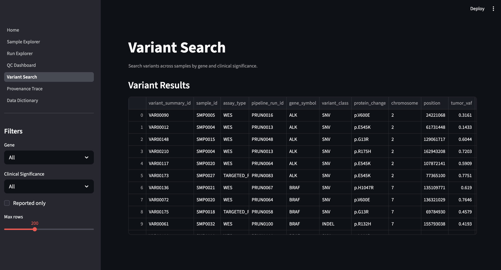
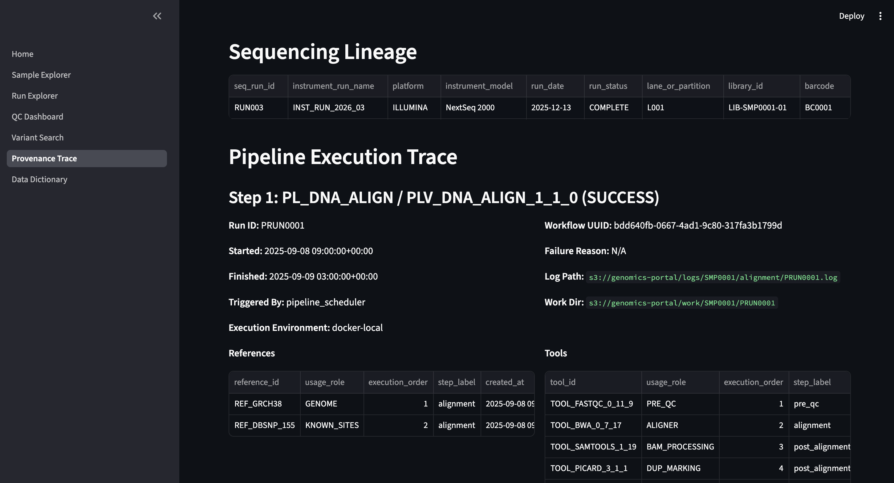
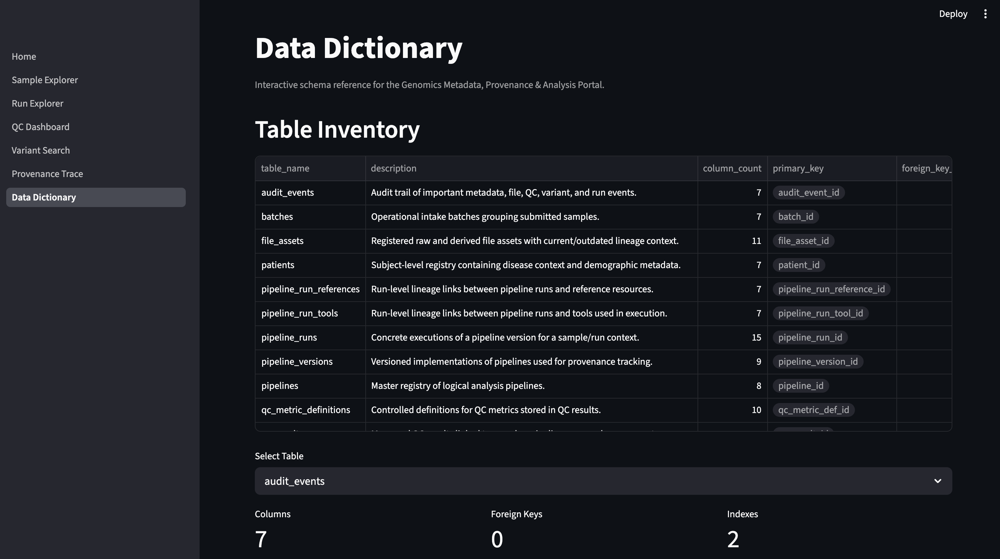

# Genomics Metadata, Provenance & Analysis Portal

Deployed on AWS EC2 with Docker Compose (on-demand startup to minimize cost)

A full-stack bioinformatics data platform for tracking samples, sequencing runs, pipeline execution, QC metrics, and variant summaries with end-to-end provenance and reproducibility.

---

## Problem Statement

Modern bioinformatics and clinical genomics workflows generate complex, multi-step data involving:

- Patient and sample metadata
- Sequencing runs across multiple platforms
- Evolving pipeline versions and toolchains
- QC metrics and validation steps
- Downstream variant analysis outputs

Many systems struggle with:

- Lack of traceability (how was this result generated?)
- Weak reproducibility (which version, tool, or reference was used?)
- Fragmented metadata across files and systems
- Limited visibility into QC failures and pipeline behavior
- Poor governance and auditability

---

## Project Goal

This project simulates a real-world research informatics and clinical bioinformatics platform designed to:

- Track the end-to-end lifecycle of genomic samples
- Capture pipeline provenance and execution lineage
- Store and query QC metrics and variant summaries
- Provide analyst-friendly exploration via UI
- Support reproducibility, governance, and auditability
- Be deployable as a production-style containerized system

---

## What This System Solves

### End-to-End Sample Tracking

Tracks the full chain from patient to sample to sequencing run to pipeline execution. Supports multiple assay types including WES, RNA-seq, and targeted panels.

### Provenance and Reproducibility

Tracks pipeline versions, tool versions, reference genomes, and execution steps in explicit relational association tables rather than opaque JSON blobs. This enables reproducibility of results, auditability for clinical and research workflows, and step-level lineage tracing for every output.

### QC Monitoring and Operational Insight

Stores QC metrics at both run and sample level with PASS, WARN, and FAIL classification. Enables detection of pipeline issues and monitoring of sequencing quality trends over time.

### Variant Exploration

Supports cross-sample variant search with filtering by gene (e.g., KRAS) and clinical significance. Links variants back to source pipeline runs and output files.

### File and Artifact Tracking

Tracks generated outputs including VCF files, QC reports, and logs, linking each file to the pipeline run and sample that produced it.

### Data Governance

Provides an interactive in-app data dictionary exposing table structure, column metadata, primary and foreign keys, and schema relationships.

---

## System Architecture
```
Streamlit UI (Analyst Interface)
        |
Repository Layer (Query Abstractions)
        |
SQLAlchemy ORM
        |
PostgreSQL (Metadata + Provenance Store)
```

---

## Tech Stack

- **Database:** PostgreSQL 16
- **Backend:** Python 3.11, SQLAlchemy
- **Frontend/UI:** Streamlit
- **Containerization:** Docker, Docker Compose
- **Data Modeling:** Relational schema with constraints and controlled vocabularies

---

## Data Model

The schema contains approximately 18 relational tables with strong enforcement of foreign keys, check constraints, and normalized master/reference data.

Key provenance tables include `pipeline_runs`, `pipeline_run_tools`, `pipeline_run_references`, and `sample_analysis_summaries`. This design captures step-level execution lineage rather than collapsing provenance into unstructured JSON.

---

## Reproducibility and Data Integrity

### Deterministic Data Generation

The synthetic dataset uses a fixed random seed, making output stable and reproducible across runs.

### Idempotent Ingestion

All ingestion scripts use insert-if-missing logic, making reruns safe without creating duplicate records.

### Strict Validation

Manifest structure, required fields, uniqueness constraints, controlled vocabularies, and foreign-key readiness are all validated before any database insertion.

### Environment-Driven Configuration

The same codebase runs in local development, Docker, and future cloud environments without code changes. All credentials and runtime configuration are passed through environment variables rather than baked into the image.

---

## Application Screenshots

### Sample Explorer


### Run Explorer


### QC Dashboard


### Variant Search


### Provenance Trace (End-to-End Lineage)


### Data Dictionary


---

## Running the Project

### 1. Clone the repository
```bash
git clone https://github.com/ramakrishna-p21/genomics-metadata-portal.git
cd genomics-metadata-portal
```

### 2. Configure environment
```bash
cp .env.example .env
```

### 3. Start the full stack
```bash
docker compose up --build
```

On first startup, the application automatically:

- Initializes the PostgreSQL schema
- Seeds reference data
- Applies schema alignment patches
- Generates synthetic data if not already present
- Ingests sample, sequencing, provenance, QC, file, and variant data
- Launches the Streamlit UI

On subsequent restarts, schema initialization is skipped and idempotent ingestion reruns safely.

The application is available at:
```
http://localhost:8501
```

---

## Testing

Run smoke tests inside the container:
```bash
docker compose exec app python -m scripts.smoke_test
```

Smoke tests cover database connectivity, core table population counts, and sample/run repository workflows.

---

## Example Use Cases

- Trace how a tumor sample was processed across multiple pipeline runs
- Identify QC failures and investigate root causes
- Search for KRAS mutations across patient cohorts
- Inspect which tools and reference genomes were used in a given analysis
- Assess the impact of pipeline version changes on downstream results

---

## Key Engineering Decisions

**Database-first design.** The PostgreSQL schema is the primary contract. SQLAlchemy ORM models are built against the existing schema rather than generating tables from Python, emphasizing SQL design and data integrity over ORM convenience.

**Explicit relational provenance modeling.** Run-to-tool and run-to-reference relationships are stored in dedicated association tables with execution order and step labels, rather than embedded in JSON columns. This makes lineage queryable and auditable.

**Repository layer abstraction.** A dedicated repository layer sits between the UI and the ORM, keeping Streamlit pages thin and making query logic reusable and independently testable.

**Idempotent ingestion.** All ingestion scripts validate manifests before insertion and skip records whose primary keys already exist, making development reruns and operational reprocessing safe.

**Environment-driven configuration.** A centralized settings module reads from environment variables, so the same application code runs locally, in Docker, and in future cloud environments without modification.

**Ingestion ordering aligned to foreign-key dependencies.** The ingestion sequence follows: sample metadata, sequencing runs, pipeline provenance, file assets, QC results, variant summaries. This ordering is enforced by the service layer through pre-insert foreign-key readiness checks.

---

## Deployment (AWS EC2)

This application was deployed on AWS EC2 using Docker Compose.

### Steps

1. Launch an EC2 instance (Ubuntu 24.04, t4g.small)
2. Install Docker and Docker Compose
3. Clone the repository:
```bash
git clone https://github.com/ramakrishna-p21/genomics-metadata-portal.git
cd genomics-metadata-portal
```

4. Configure environment:
```bash
cp .env.example .env
```

5. Start the application:
```bash
docker compose up --build
```

The application is available at:
```
http://<EC2_PUBLIC_IP>:8501
```

### Cost Optimization

The EC2 instance can be stopped when not in use to minimize cost.

---

## Future Improvements

- Cloud deployment to ECS or a managed container platform
- REST API layer (FastAPI)
- Role-based access control
- CI/CD pipeline
- Authentication and audit trails

---

## Why This Project Matters

This project demonstrates the ability to design provenance-aware data systems, build bioinformatics metadata platforms, implement reproducible ingestion pipelines, and deliver analyst-facing applications in a production-style containerized architecture. It directly reflects real-world challenges in bioinformatics, research informatics, and clinical genomics operations.

---

## Author

Rama Krishna Pudota